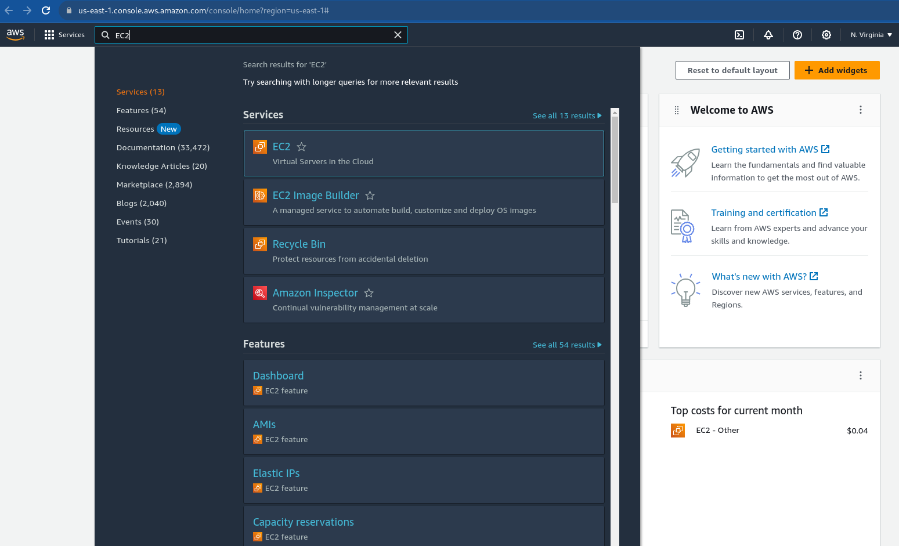
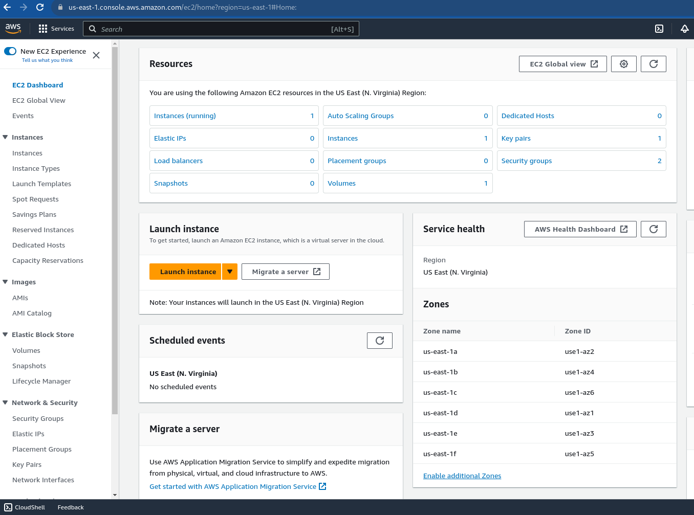
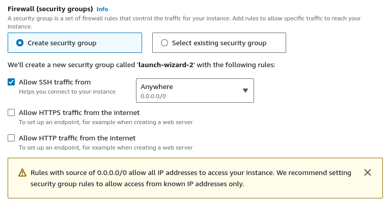
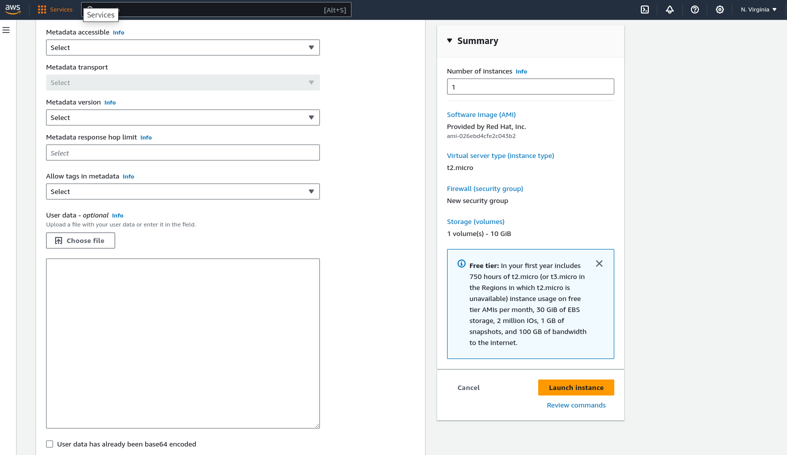
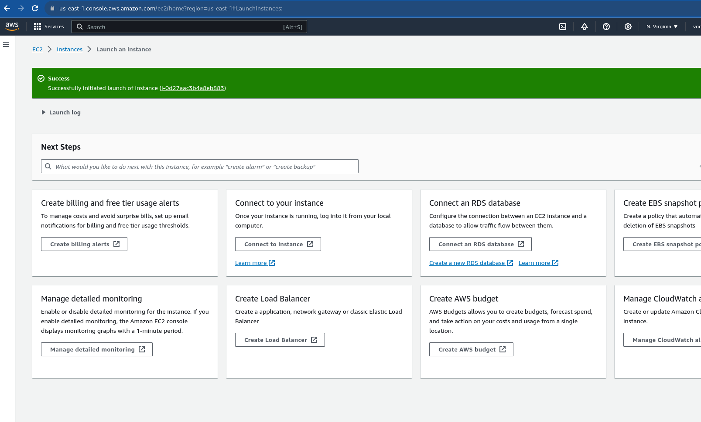
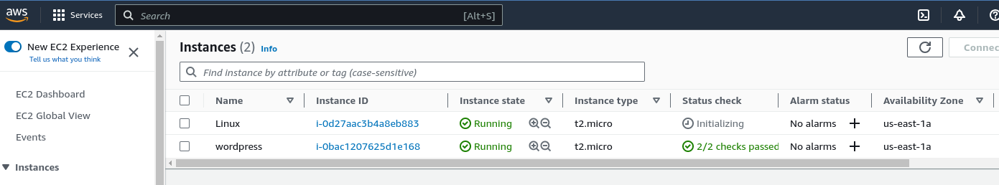

# Creating and Accessing a Linux EC2 Instance

## Objectives
- Creating a Linux EC2 instance on AWS cloud
- Enabling SSH access to the Linux EC2 instance
- Accessing the EC2 instance on AWS using an SSH client

## Introduction
Amazon EC2 (Elastic Compute Cloud) is a scalable cloud service by AWS, providing resizable compute capacity for various applications with pay-as-you-go pricing. Users can customize instances, ensuring flexibility and efficient resource utilization.

In this lab, you will start a Linux EC2 instance and access it via SSH.  

## Procedure

### Creating and Starting a Linux EC2 Instance

1. Login to the AWS console 
2. Locate the EC2 service under Compute or search for the service: Click on EC2.
3. You will be presented with the EC2 dashboard: 
4. Click on "Launch Instances". Use the following settings for the details:

    i. Name: *LinuxServer*
    
    ii. Amazon Machine Image: *Redhat 9 (default settings)* 

    iii. Key pair name: *Select the only one available in the drop-down*

    iv. Security groups: *Allow SSH traffic from anywhere* 

    v. Expand "Advanced details", you will see a section called "User data" which can be use to provide addtional startup commands to run when the instance first start up.  Leave it alone for now.  

    vi. Click on "Launch instances"

    vii. Return to your EC2 Dashboard.  You can do this by clicking on the "Instances" link. 

    viii. Your EC2 Dashboard will show your instance starting up. 
    Wait for the Status check to reach "2/2 checks passed".  You can click the refresh icon to update the current status.

    ix. Clicking on the instance on the dashboard will show instance details, such as the IP address.  Note down the public IPv4 address, you will need this to connect to the instance.  

### Connecting to the EC2 Linux instance

5. To connect to the instance that you have launched, you will need to have access to the private key which you have specified in the step earlier.  Check with your instructor if you are unsure.  

6. Open a command prompt and type in the command in the following syntax.  Note

    ```cmd
    ssh -i PATH_TO_PEM_FILE -l ec2-user PUBLIC_IP_ADDRESS
    ```
    Note that PATH_TO_PEM_FILE is to be replaced by the location of the pem file in step 5.  PUBLIC_IP_ADDRESS is the public ip address of your EC2 instance.  

7. If all goes well you gain access to your Linux EC2 instance via SSH and you will see a prompt similar to:
    ```bash
    [ec2-user@ip-172-31-100-100 ~]$
    ```

You are now logged into a Linux EC2 instance on the AWS cloud.  

## Conclusion
In this lab, a Linux EC2 instance was created on the AWS cloud.  

As part of the instance creation process, SSH access to the Linux EC2 instance was allowed by configuring the Security Group.  The key pair used to access was also specified during instance creation.  

Finally, the EC2 instance was accessed using an SSH client

## References
- [Connect to your Linux instance
](https://docs.aws.amazon.com/AWSEC2/latest/UserGuide/connect-to-linux-instance.html)
